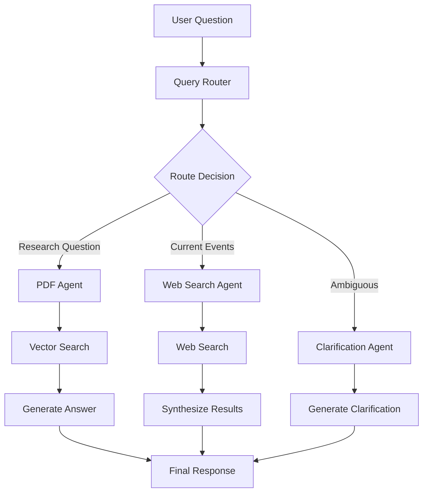

# Chat With PDF Backend

A sophisticated multi-agent RAG (Retrieval-Augmented Generation) system that enables intelligent question-answering over academic papers. Built with FastAPI, LangGraph, and LangChain, this system provides a "Chat With PDF" assistant capable of handling complex queries, performing web searches, and providing clarification for ambiguous questions.

## 🚀 Features

- **Multi-Agent Architecture**: Uses LangGraph to orchestrate specialized agents for optimal responses
- **PDF-First RAG**: Intelligent retrieval and generation from academic papers
- **Web Search Integration**: Falls back to web search for current information not in PDFs
- **Clarification Agent**: Handles ambiguous queries by requesting specific details
- **Session Memory**: Maintains conversation context within user sessions
- **RESTful API**: Clean API endpoints for integration
- **Docker Support**: Easy deployment with Docker and docker-compose

## 🏗️ Architecture Overview

The system employs a multi-agent architecture using LangGraph for orchestration:

### Agents

1. **Query Router**: Analyzes incoming questions and routes them to the appropriate agent
2. **PDF Agent**: Searches and answers questions from embedded academic papers
3. **Web Search Agent**: Performs web searches for current information using Tavily API
4. **Clarification Agent**: Detects ambiguous questions and requests clarification

### Agent Workflow



### Technology Stack

- **FastAPI**: High-performance web framework
- **LangGraph**: Agent orchestration and workflow management
- **LangChain**: LLM integration and document processing
- **ChromaDB**: Vector database for document embeddings
- **OpenAI GPT-4**: Large language model for generation
- **Tavily API**: Web search capabilities
- **Docker**: Containerization and deployment

## 📋 Requirements

- Python 3.11+
- Docker and docker-compose
- OpenAI API key
- Tavily API key (optional, will use mock results without it)

## 🛠️ Installation & Setup

### 1. Clone and Setup

```bash
git clone <repository-url>
cd arcfusion-test
```

### 2. Environment Configuration

```bash
cp .env.example .env
```

Edit `.env` with your API keys:

```env
OPENAI_API_KEY=your_openai_api_key_here
TAVILY_API_KEY=your_tavily_api_key_here
```

### 3. Local Development Setup

```bash
# Install dependencies
pip install -r requirements.txt

# Ingest PDF documents
python scripts/ingest_pdfs.py

# Run the application
python -m uvicorn app.main:app --reload
```

### 4. Docker Deployment

```bash
# Build and run with docker-compose
docker-compose up --build

# Or run just the application
docker build -t chat-with-pdf .
docker run -p 8000:8000 --env-file .env chat-with-pdf
```

## 🐳 Running with Docker Compose

```bash
# Start the system
docker-compose up -d

# View logs
docker-compose logs -f

# Stop the system
docker-compose down
```

The application will be available at `http://localhost:8000`

## 📚 API Documentation

Once running, visit:
- **Interactive API Docs**: `http://localhost:8000/docs`
- **OpenAPI Schema**: `http://localhost:8000/openapi.json`

### Key Endpoints

#### Ask a Question
```bash
POST /api/v1/ask
{
    "question": "What prompt template gave the highest zero-shot accuracy on Spider in Zhang et al. (2024)?",
    "session_id": "optional-session-id"
}
```

#### Clear Session Memory
```bash
POST /api/v1/clear-memory
{
    "session_id": "session-id-to-clear"
}
```

#### Health Check
```bash
GET /api/v1/health
```

## 🧪 Testing the System

### Example Queries

1. **PDF-Only Query**:
   ```
   "Which prompt template gave the highest zero-shot accuracy on Spider in Zhang et al. (2024)?"
   ```

2. **Ambiguous Query** (triggers clarification):
   ```
   "How many examples are enough for good accuracy?"
   ```

3. **Web Search Query**:
   ```
   "What did OpenAI release this month?"
   ```

### Real-World Test Scenarios

The system handles the scenarios mentioned in the assignment:

1. **Ambiguous Questions**: Detects vague terms and requests clarification
2. **PDF-Only Queries**: Searches embedded research papers for specific findings
3. **Out-of-Scope Queries**: Routes to web search for current information

## 🔧 System Configuration

### PDF Processing

- **Chunk Size**: 1000 characters (configurable)
- **Chunk Overlap**: 200 characters (configurable)
- **Embedding Model**: `sentence-transformers/all-MiniLM-L6-v2`

### Agent Settings

- **OpenAI Model**: `gpt-4-turbo-preview`
- **Max Iterations**: 10
- **Session TTL**: 1 hour
- **Max Session Memory**: 50 messages

### Vector Database

- **Engine**: ChromaDB
- **Persistence**: Local file system
- **Similarity Search**: Cosine similarity

## 📁 Project Structure

```
arcfusion-test/
├── app/
│   ├── agents/           # Multi-agent implementation
│   │   ├── router.py     # Query routing logic
│   │   ├── pdf_agent.py  # PDF retrieval agent
│   │   ├── web_agent.py  # Web search agent
│   │   ├── clarification.py # Clarification agent
│   │   └── graph.py      # LangGraph orchestration
│   ├── api/
│   │   └── endpoints.py  # FastAPI routes
│   ├── models/
│   │   └── schemas.py    # Pydantic models
│   ├── services/
│   │   ├── pdf_ingestion.py # PDF processing
│   │   ├── vectorstore.py    # Vector database
│   │   └── session.py        # Session management
│   ├── config.py         # Configuration
│   └── main.py          # FastAPI application
├── scripts/
│   └── ingest_pdfs.py   # PDF ingestion script
├── papers/              # PDF documents
├── requirements.txt
├── Dockerfile
├── docker-compose.yml
└── README.md
```

## 🔄 How It Works

### 1. Document Ingestion
- PDFs are loaded and chunked using LangChain's text splitters
- Chunks are embedded using SentenceTransformers
- Embeddings are stored in ChromaDB with metadata

### 2. Query Processing
- User questions are routed through the LangGraph workflow
- Router determines the best agent based on query analysis
- Selected agent processes the query and generates a response
- Session memory maintains conversation context

### 3. Multi-Agent Coordination
- **Router Agent**: Analyzes queries and determines routing
- **PDF Agent**: Searches vector database and generates answers
- **Web Agent**: Performs web search and synthesizes results  
- **Clarification Agent**: Handles ambiguous queries

### 4. Response Generation
- Agents use OpenAI GPT-4 for natural language generation
- Sources are tracked and returned with responses
- Confidence scores help indicate answer reliability

## 🚀 Future Improvements

### Performance & Scalability
- [ ] Implement Redis for session management
- [ ] Add database connection pooling
- [ ] Implement caching for frequent queries
- [ ] Add support for multiple PDF collections

### Enhanced Features  
- [ ] Document upload via API
- [ ] Advanced query analysis with intent detection
- [ ] Multi-modal support (images, tables)
- [ ] Export conversation history

### Production Readiness
- [ ] Comprehensive logging and monitoring
- [ ] Rate limiting and authentication
- [ ] Performance metrics and alerting
- [ ] Load balancing support

### AI Improvements
- [ ] Fine-tuned embedding models
- [ ] Advanced prompt engineering
- [ ] Query expansion techniques
- [ ] Hybrid search (semantic + keyword)

## 🐛 Troubleshooting

### Common Issues

1. **Vector store not found**: Run `python scripts/ingest_pdfs.py` to ingest documents
2. **API key errors**: Ensure `OPENAI_API_KEY` is set in environment
3. **Permission errors**: Check file permissions for data directories
4. **Memory issues**: Reduce chunk size or use smaller embedding models

### Logs

Check application logs:
```bash
# Docker
docker-compose logs -f chat-with-pdf

# Local
tail -f logs/app.log
```

## 📄 License

This project is developed for the ArcFusion technical assignment.

## 🤝 Contributing

This is a technical assessment project. For questions or clarifications, please reach out to the development team.

---

**Note**: This system demonstrates production-ready architecture patterns and can be extended for real-world applications with appropriate scaling and security considerations. 